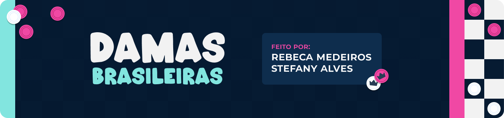
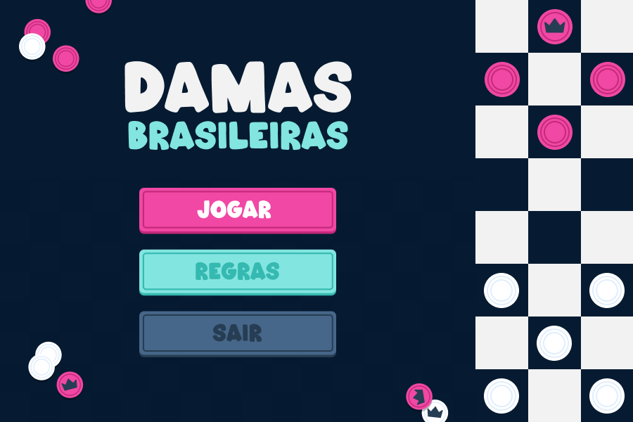
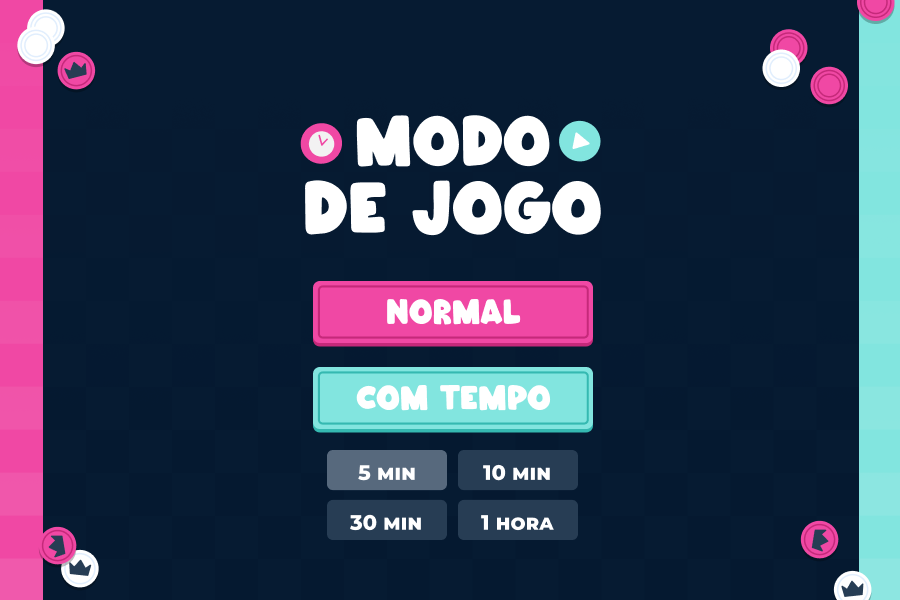
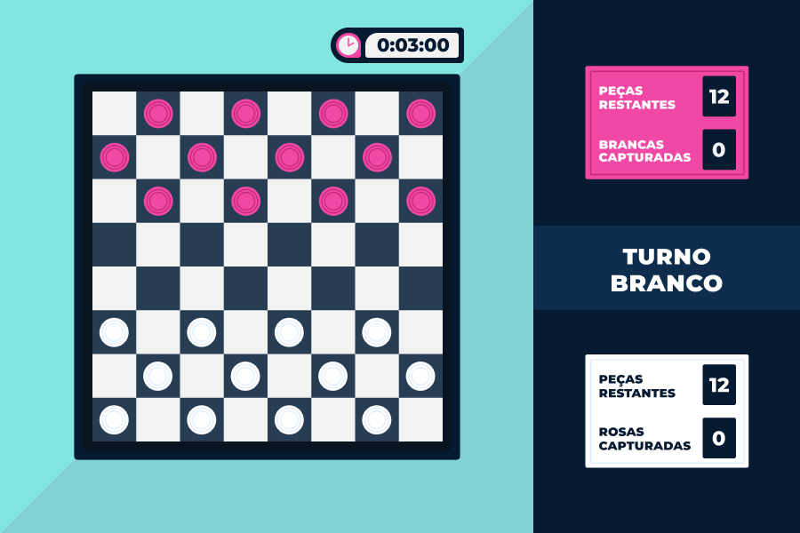
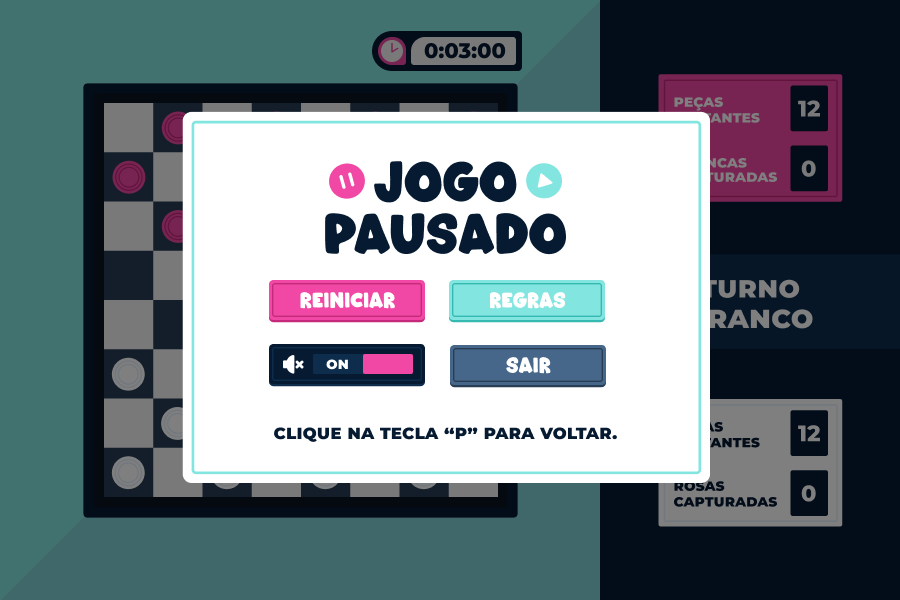

<p align="center">
  
</p>

# Jogo de Damas Brasileiras</h1>

Um jogo de damas desenvolvido em **Python** utilizando a biblioteca `Pygame` para construção da interface gráfica, sonoplastia e manipulação de eventos.
O projeto foi estruturado com **Programação Orientada a Objetos (POO)** e dividido em módulos para facilitar a organização, manutenção e leitura do código.

> Desenvolvido por **Rebeca de Medeiros Silva** e **Stefany Nicole Santos Alves** como projeto das disciplinas Laboratório de Programação I e Programação I, do curso de **Ciência da Computação da UFCG**, no período **2025.1**. 

## 📁 Estrutura do Projeto  

```
| assets/                     # Recursos visuais e sonoros
| ├─ font/                    # Arquivos de fontes usadas no jogo
| ├─ images/                  # Arquivos de imagens usadas no jogo
| ├─ screenshots/             # Screenshots do jogo
| └─ sounds/                  # Arquivos de músicas e efeitos sonoros

| classes/                    # Mecânica do jogo
| ├─ controlador.py           # Regras e mecânicas das jogadas
| ├─ peca.py                  # Classe que define os atributos das peças do jogo
| └─ tabuleiro.py             # Classe que cria e armazena o estado do tabuleiro

| ui/                         # Interfaces e telas do jogo
| ├─ botao.py                 # Classe para os botões do menu
| └─ telas.py                 # Funções das telas de pausa, fim, jogo, modo de jogo, regras

| utils/                      # Funções auxiliares e configurações globais
| ├─ complementos.py          # Funções extras (cliques, tempo, música)
| ├─ config.py                # Configurações globais (cores, imagens, sons, textos)
| └─ interface.py             # Informações visuais (placar, turno, timer)

| main.py                     # Arquivo principal que inicia o jogo
```

## 📸 Screenshots

|  |  |
|:-----------------------------------------------------------:|:--------------------------------------------------------:|
|  |  |


## ✅ Como Executar   

O jogo utiliza a biblioteca **Pygame 2.6+**, que deve ser instalada antes da execução.  

1. Certifique-se de ter o **Python 3.12+** instalado:  
   ```bash
   python --version

2. Instale o **Pygame**:
   ```bash
   pip install pygame

3. **Clone o repositório**  
   ```bash
   git clone https://github.com/rebecamdrs/Projeto-Damas
   cd repositorio
   ```

4. **Execute o jogo**  
   ```bash
   python main.py
   ```


## 💡 Funcionalidades  

- Interface gráfica amigável utilizando **Pygame**  
- Dois modos de jogo: **normal** e **tempo** com opções de 3min, 5min, 10min ou 15min.
- Gerenciamento de áudio: músicas de fundo e efeitos sonoros dinâmicos  
- Tela de regras para consulta dos jogadores  
- Tela de pausa com opções de reinício, regras, silenciar música ou sair  
- Tela pop-up ao clicar em **"X"**, confirmando se o jogador quer realmente sair  
- Tela final com resultado da partida (jogador vencedor, empate, tempo esgotado)


## ⚙️ Mecânicas do Jogo  

- **Captura normal** – peças podem capturar oponente avançando sobre elas.  
- **Captura voltando** – é permitido capturar peças também ao retornar.  
- **Captura múltipla** – é possível encadear várias capturas em um único turno.  
- **Captura obrigatória** – quando há uma possibilidade de captura, o jogador **deve** realizá-la (não pode mover outra peça).  
- **Destaque de movimentos possíveis** – ao selecionar uma peça válida, os destinos disponíveis aparecem.  
- **Seleção inválida de peça bloqueada** – peças sem movimentos, adversárias ou contrárias à regra de captura obrigatória não podem ser movidas (um **círculo vermelho** aparece ao redor dela, indicando a jogada incorreta).  
- **Condições de empate**:  
  - Nenhum jogador tem mais movimentos possíveis.  
  - Pela **regra dos 20 lances** (quando não há captura ou promoção por 20 jogadas consecutivas, ambos jogadores).  


## ⚠️ Requisitos

- **Python 3.12+**  
- **Pygame 2.6+** (biblioteca principal para gráficos e sons)  
